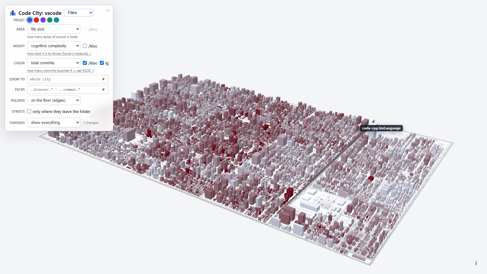

# Code City JS

Turn any git checkout of **JavaScript / TypeScript** into a **3-D city you can
walk around**: one building per file, districts per folder, its height and
colour driven by whatever you want to see — size, cognitive complexity, churn,
bug-fixes, **internal coupling roads**, and **coverage / CRAP** when you point
at an Istanbul report. Plus the 2-D **codemap** it ships with: a treemap next
to a log–log scatter.

This is a port of [Victor Rentea's Code City](https://github.com/victorrentea/code-city)
from Java to the JS/TS world — React, Vue, or no framework. The original is the
**guide**: we copy its city renderer, keep its metrics and overlays, and redo
the language front-end (what a building is, how history joins, complexity,
coupling, coverage). It is not a fork we silently diverge from; every
intentional renderer difference is listed in
[`vendor/RENDERER-DELTA.md`](vendor/RENDERER-DELTA.md).

Every output is a **single self-contained HTML file** — all data inlined,
libraries from a CDN, no server. Mail it, publish it on Pages, open it from
disk.



*Visual Studio Code: 9302 source files, 1722 folders — one run, one page.
Height is cognitive complexity (Sonar-style via tree-sitter), colour is
commits per KLOC on a log ramp. Hold ⌥ for internal coupling roads. Point
`CODECITY_COVERAGE` at an Istanbul `coverage-final.json` to colour by
coverage / CRAP (not faked from LOC). Plain hover worst ~9.5 ms on this
plate (budget under 50 ms).*

## Quick start

You need **Python 3**, **Node.js on `PATH`**, **npm**, and **git**.

Install the generators **once** per machine / env (not before every city):

```bash
git clone https://github.com/balazsbohonyi/code-city-js
cd code-city-js
pip install -r requirements.txt   # tree-sitter JS/TS grammars (complexity)
npm install                       # dependency-cruiser + TypeScript + Vue SFC (coupling)
```

On Windows PowerShell, if `npm` is blocked by the execution policy, use
`npm.cmd install` instead. Re-run `pip install` / `npm install` only when
`requirements.txt` or `package.json` change, or in a fresh venv.

The target must be a **git checkout** of JS/TS sources (full history preferred).
That is the whole per-repo configuration: the path to analyse.

```bash
# from anywhere, after Install above
python /path/to/code-city-js/generate.py /path/to/your-repo

# Windows:  start  your-repo\.codecity\codecity.html
# macOS:    open   your-repo/.codecity/codecity.html
# Linux:    xdg-open your-repo/.codecity/codecity.html
```

```powershell
# Windows example
python C:\path\to\code-city-js\generate.py C:\path\to\your-repo
start C:\path\to\your-repo\.codecity\codecity.html
```

Optional second argument = output directory (default `REPO/.codecity`):

```bash
python /path/to/code-city-js/generate.py /path/to/your-repo /tmp/my-city
```

Thin wrappers: `generate.sh` / `generate.ps1` (same args). Every knob has an
env-var twin (see [Configuration](#configuration-env-vars)) for CI use.

| File | What it is |
| --- | --- |
| `codecity.html` | the 3-D city (Three.js) |
| `codemap.html` | the 2-D treemap + scatter (Plotly) |
| `combined.html` | both, side by side, hover-linked |
| `*.tsv` | the measurements, if you want to plot your own |

Do not commit generated cities. Nothing special is required **inside** the
target repo (no config file, no dependency-cruiser install there).

**Without Node:** `generate.py` still builds a city (size, git, complexity).
Fan-in/out stay `0` and ⌥ roads stay off.

## What a building is

Java almost gets a free mapping: one class, one file, one package. JS/TS
does not. This port picks the closest honest analog and sticks to it:

| City thing | JS/TS |
| --- | --- |
| Building | one **source file** (`.js` `.jsx` `.mjs` `.cjs` `.ts` `.tsx` `.mts` `.cts` `.vue` `.svelte`) |
| District | the **folder** that contains it (`src/components/charts/BarChart.tsx` lives in `src.components.charts`) |
| Module | the nearest ancestor **`package.json`** (a pnpm/npm workspace package, or the repo root) |

Tests (`*.test.*`, `*.spec.*`, `test/`, `tests/`, `e2e/`, …), `node_modules`,
`dist`, `.next` and other build output are not buildings. Demo trees
(`examples/`, `playground/`) **are** buildings unless you name them in
`HEATMAP_PRUNE` — [Skipping demos](#skipping-demos-heatmap_prune). A function
is not a building, and neither is an exported React component — those are
later lenses if they earn one. An 800-line `utils.ts` is one fat block,
which is the truth.

The city does not special-case “this is a React app.” It special-cases file
kinds.

A `.svelte` file is still a building (it has a footprint). Cognitive complexity
and coupling today walk JavaScript, TypeScript, JSX/TSX, and Vue `<script>` /
`<script setup>` — not Vue templates, and not Svelte / Angular / Astro
templates. Support for template complexity and those other frameworks is
coming.

## How this differs from the Java Code City

The picture is the same city: Wettel’s software city, Victor’s renderer,
metrics on area / height / colour, held-key overlays, a self-contained HTML
page. What changes is the **language front-end** — how a JS/TS tree becomes
rows the city already knows how to draw.

| Topic | [Java Code City](https://github.com/victorrentea/code-city) | This port |
| --- | --- | --- |
| Building | class (almost always one `.java` file) | one **source file** |
| District | Java package; `_district` collapses every same-named folder | **full dotted folder path** (`src.components.charts`) so three `components/` folders stay three districts |
| Module | Maven module (`pom.xml`) | nearest **`package.json`** |
| Complexity (height) | tree-sitter Java, summed over methods | tree-sitter **JS/TS** + Vue `<script>`; `??` counts in boolean groups, `?.` does not; templates unscored |
| Coupling (⌥ roads) | Java identifier scan | **dependency-cruiser** (Node); `import type` dropped; barrels resolve-through; no `node_modules` |
| Coverage / CRAP | JaCoCo XML (cyclomatic + **line** coverage in one report) | Istanbul **`coverage-final.json`** + tree-sitter **cyclomatic**; **statement** coverage; `generate.py` never runs tests |
| Without extra toolchain | Python + git | Python + git still build a city; **no Node** → fan-in/out 0, roads off |
| Picture | Wettel via Victor’s renderer | same renderer, **copied**; delta in [`vendor/RENDERER-DELTA.md`](vendor/RENDERER-DELTA.md) |

The 2-D treemap buckets repo-root files under `root` (never the filename as
its own parent id — that blanks Plotly). Filter suggestions are folders and
JS/TS name families (`..components.*`, `use*`, `*Dialog`), not `*Service`.

Geometry, camera, streets, change marks, and hover budget are documented in
[CodeCity](#codecity) below — they are the same arguments as the Java city,
with file / folder nouns.

## What each metric means

The page lets you put any column on **area**, **height** or **colour**. Colour
is often a **ratio** (`/kloc`) on a log ramp, clamped at the p95 so a few
extreme files don't wash out the rest.

**Open a file in your editor:** ⌘/Ctrl-double-click a building. The city
opens **VS Code** (`vscode://file/…`). The 2-D codemap also has an in-page
picker for **IntelliJ** (IntelliJ uses its built-in web server, so the IDE
must be running with *Settings ▸ Build, Execution, Deployment ▸ Debugger ▸
"Allow unsigned requests"* enabled). Unset `HEATMAP_OPEN_IN` to disable
click-to-open.

| Column | Meaning |
| --- | --- |
| `bytes` / `lines` | file size and line count |
| `commits` | non-merge commits that touched the file (full history) |
| `bug_commits` | of those, commits whose subject matches `fix` / `fixed` / `fixes` / `bugfix` (Conventional Commits and the plain “Fix …” verb) |
| `committers` | distinct author emails that touched the file |
| `cognitive_complexity` | Sonar-style cognitive complexity (tree-sitter, summed over functions). JS/TS/JSX/TSX, plus Vue `<script>` / `<script setup>` — not templates. `??` counts in boolean groups (intentional); `?.` does not. |
| `cochange_out` | of the commits that touched this file, the share that also reached outside its folder, weighted by how far out ([Change coupling](#change-coupling--the-crime-scene)) |
| `fan_in` / `fan_out` | how many **repo** files import this file / it imports (internal coupling only); `coupling-edges.tsv` holds the same relation edge by edge, weighted by how often the source names the target — what the Coupling-streets overlay draws |
| `coverage` | statement coverage %, from an Istanbul report ([CRAP and coverage](#crap-and-coverage--the-two-metrics-that-need-the-tests-to-have-run)) |
| `coverage_acceptance` | statement coverage % reached by an **optional second suite** alone ([two suites, two numbers](#two-suites-two-numbers)) |
| `crap_max` / `crap_load` | the worst function's CRAP in this file, and the sum over its functions |

**Presets.** **Overview** is absolute complexity (tall = hard to follow).
**Complexity density** puts `/kloc` on height as well — complexity *per
thousand lines* — so large complex files shrink toward the pack and the
skyline looks flatter; that is intentional, not a missing score.

**Absence is not zero.** Files the coverage report never measured stay grey,
not “0% covered.” Same rule as the Java city with JaCoCo.

## Pipeline

After the once-per-env install in [Quick start](#quick-start):

```bash
python generate.py /path/to/your-repo
```

| Step | Script | Produces |
| --- | --- | --- |
| 1 | `compute_complexity.py` | `complexity-per-file.tsv` (Sonar-style cognitive scores) |
| 2 | `compute_fanio.mjs` | `fanio-per-file.tsv` + `coupling-edges.tsv` (`source`, `target`, `weight`, and the `line` in the source where the coupling first appears outside the imports). Needs Node. |
| 3 | `compute_crap.py` | `crap-per-file.tsv` — CRAP and statement coverage, **only** where an Istanbul report was found; else deletes a stale one |
| 4 | `build_heatmap.py` | `codemap.tsv` (joins git history + file size + steps 1–3) + `cochange-edges.tsv` (who changes with whom, from the same history walk) |
| 5 | `render_heatmap.py` | `codemap.html` |
| 6 | `render_codecity.py` | `codecity.html` |
| 7 | `render_combined.py` | `combined.html` |

`citylib.py` is the JS/TS front of inclusion: which files count, how a folder
becomes a district, how a `package.json` becomes a module, which bucket a
file uses in the 2-D treemap (repo-root files under `root`, so Plotly never
sees duplicate ids), and which globs the filter box offers for *this* city
(not a hard-coded `*Service`).

## Skipping demos (`HEATMAP_PRUNE`)

The default skip list is things that are never the product: test folders,
`node_modules`, `dist` / `build` / `.next` / `.nuxt`, coverage, vendored
trees. It does **not** skip `examples/` or `playground/`.

Those folders are source, and they have `package.json` files, so they become
districts *and* modules. On [expressjs/express](https://github.com/expressjs/express)
the plate is mostly `examples/`. On [vitejs/vite](https://github.com/vitejs/vite)
it is worse: most of the buildings are playground fixtures, each its own
tiny package, and the real city (`packages/vite` — `css.ts`, `config.ts`,
the server) sits on the left while the labels drown on the right. The 2-D
scatter already drops files under 50 lines, so it still reads as Vite; the
3-D default cannot, because a two-line `import.mjs` is still a building.

They stay on by default because a repo whose product *is* examples would
vanish, and because the match is a **folder name**, not a path. Pruning
`playground` must drop `repo/playground/hmr` and must not drop a checkout
that happens to live under `…/playground/vite`.

`HEATMAP_PRUNE` is extra names, comma-separated, matched as path segments
*inside the repo*. Rebuild after setting it.

```bash
# bash / Git Bash — Vite product city (drop playground, docs, and create-vite templates)
HEATMAP_PRUNE=playground,docs,create-vite python /path/to/code-city-js/generate.py /path/to/vite
```

```powershell
# PowerShell
$env:HEATMAP_PRUNE = "playground,docs,create-vite"
python C:\path\to\code-city-js\generate.py C:\path\to\vite
```

Useful names: `playground`, `playgrounds`, `examples`, `docs`,
`create-vite`, `packages-private`. The name has to be a directory segment
(`playground`), not a glob and not a repo-relative prefix.
`packages/create-vite/template-*` does **not** go away when you prune
`playground` — those scaffolds live under a folder named `create-vite`, so
name that segment too (as in the Vite recipe above).

Always-on skips (tests, `node_modules`, build output) do not need the knob.
Unset `HEATMAP_PRUNE` is the whole-tree city.

## CodeCity

`codecity.html` renders the same TSV as a Three.js CodeCity. Drag to pan,
Cmd/Ctrl-drag to rotate, scroll to zoom around the mouse cursor, and
Cmd/Ctrl-double-click a building to open its file in VS Code. The 2-D layout
is computed in-browser with D3 treemap; Three.js extrudes each file tile
into a building.

**Prior art, and the page says so.** The software city — a building per
compilation unit, a district per containment, metrics mapped to height,
footprint and colour — is [CodeCity](https://wettel.github.io/codecity.html),
by Richard Wettel (Università della Svizzera italiana, 2008). Victor Rentea
re-implemented that picture over a different set of metrics for **Java**.
This repo ports his generators to **JS/TS**. Both credits ride in the
bottom-left corner of every page, because that is where the picture is.

**City geometry & camera** — tuned to Wettel's original CodeCity plates. The
ground is a **landscape rectangle** (1.6:1), not a square, and the opening
shot is *computed* from the city's bounding box rather than hard-coded: a
long 30° lens placed far enough back that the whole plate fits, low over the
horizon and swung off-axis. There is **no fog** — far districts stay as
crisp as near ones.

**The plate is the size of the codebase.** Ground area grows with total lines
at a fixed density, so a file of a given size gets the same footprint in
every repo and two cities are to scale with each other. Everything drawn
*on* the plate — streets, folder-name bands, the height scale — is sized
from ONE TILE rather than from the plate, which keeps a 9000-file city
looking like a 120-file one seen from higher up. That is also the honest
picture: it IS the same city with more of it.

- **height** scales with the tile too, and above the p95 the curve goes
  logarithmic, so one monster file doesn't spike the whole skyline;
- **streets narrow with nesting depth** — boulevards between top-level
  modules, alleys between leaf folders, instead of one flat gap that eats a
  deep tree's plate. The street is charged between SIBLING DISTRICTS; two
  files inside one folder keep the tight file gap, because they are meant to
  read as one block;
- **the plate is flat, and containment is drawn rather than built.** Every
  nesting level used to rise a terrace above its parent, which said "this
  folder contains those" and, from the low angle a city is actually read at,
  also walled off the near edge of everything behind it and buried the roads
  until they had to be flown over the whole stack. Each district gets a
  **black rule laid inside its own edge** instead, and the rule's **weight
  falls with depth**: a heavy band round a top-level module, a hairline
  round a leaf folder six levels down. Weight is the one line property the
  eye reads without measuring, it costs no parallax, and it survives being
  looked at from ground level. It is a quad ring rather than a line, because
  WebGL ignores `linewidth` — "thicker for a module" is not expressible as a
  line at all, and a one-pixel rule vanishes at exactly the zoom that shows
  the whole city;
- a file **name appears only once its roof is ≥ 26 px on screen** (waived in
  *highlight changed*), so a huge city zoomed out is a clean plate and the
  names come back as you zoom in;
- **folder names are written flat on their own floor**, in a margin the
  treemap *reserves* on all four edges of every district, and written into
  each of them — so whichever way you orbit, a copy faces you. The margin is
  not decoration: a district's children tile the whole of its interior, so
  text laid anywhere else is buried. Both the margin and the **cap height
  are the same at every nesting level** (the letters overhang the margin to
  stay readable, and are centred in what is left of it once the black rule
  has taken the outer strip): how big a folder is, is what the plate already
  shows — the name is an identifier, not a metric, and two names in two
  sizes claim otherwise;
- the **depth buffer is logarithmic** and the near plane rises with the
  plate. Without both, a big city flickers where surfaces meet (a base on
  its floor, a name on the plate) — even standing still, because camera
  damping never quite stops.

**The control panel** stacks one knob per row, each row a single question, so
the three visual axes read as independent choices rather than one wide
toolbar:

| row | what it sets |
| --- | --- |
| `FILTER` | AspectJ-style glob (`..components.*`, `..lib..`, `use*`, `*Dialog`). It is a text box **with a dropdown** (its chevron always visible, or nobody finds it): the generator offers the biggest folders and the name families it finds — `use*` hooks, CamelCase prefixes shared by ≥ 3 files, clustered suffixes (`*Dialog`, `*Chart`) — each with its file count. |
| `PRESET` | ten coloured bubbles, one click each: a saved reading of the city (overview, hotspots, bug density, complexity density, knowledge risk, coupling, instability, churn vs. team, plain size, dependencies). A bubble sets all three metrics *and* the four bits below; the row's caption spells out which reading you are on, and reads *Custom* as soon as you turn any knob under it. |
| `AREA` / `HEIGHT` / `COLOR` | the metric on that axis, plus a **`/kloc`** checkbox that swaps a raw count for its density twin (complexity, commits, bugfixes). Where no density exists the checkbox greys out instead of disappearing, so the rows keep their shape. Colour also carries **`lg`**, the log-vs-linear ramp: it ticks itself to what the chosen metric wants and remembers your override per metric for the session. Default reading: area = file size, height = cognitive complexity, colour = commits per KLOC (log). |
| `ZOOM TO` | drill into one folder by name, with autocomplete over every folder in the current lens — the typed form of shift-clicking a floor. |
| `FOLDERS` | folder-name style: floating tags, on the floor, or off. |
| `STREETS` | `only where they leave the folder` — drop the intra-folder roads from every coupling bundle, so ⌥ answers "what does this file reach OUTSIDE its own folder". |
| `CHANGES` | the change-set filter (below). |

Whatever one metric dropdown shows is greyed out in the other two — spending
two of the city's three channels on the same number says nothing twice.

**Change-set filter:** a **Change set** selector focuses the city on the files
in the *current git change set*, baked in when the page is generated. Three
modes:

1. **show everything** — the normal city.
2. **highlight changed** (**the default**, whenever a change set was detected)
   — unchanged buildings drain to grey and drop to 50% opacity, so the
   change set holds the only real colour on screen. It is also the only mode
   that **names** buildings: every changed building becomes a label
   candidate, ranked by how much of it the eye already caught — its
   **volume** (footprint × height) and its **intensity** on the colour ramp,
   whichever of the two is stronger — and the screen is then filled top-down
   with as many of those names as actually fit at the current camera (the
   "roof too small to own a name" gate is waived here, and the control
   panel's own rectangle counts as taken, so no name hides under it).
3. **only changed** — unchanged buildings are removed from the layout
   entirely, so the treemap collapses to just the change set.

A generated city is nearly always being read to answer *what did this
change?*, so the page **opens on the diff** rather than making the reader
find the selector first. When no change set could be detected the **whole
Changes row is removed** — three modes that would all draw the identical
city are not a choice worth offering.

**Where a grown building used to end:** highlighting says *which* files a
diff touched, never *what it did to them* — a file that doubled and one that
only moved a line are the same shade of not-grey. So in *highlight changed*
every building that GREW carries two dashed black marks, the only ink on a
building anywhere in the city:

- a **band around the facade** at the height the block used to reach — the
  *height* axis;
- a **rectangle on the roof** enclosing the footprint it used to have — the
  *area* axis.

The building itself is untouched — same size, same colour the city would
give it anyway — so nothing is exaggerated: the marks simply say where it
ended before. They are drawn with `Line2`, because WebGL ignores `linewidth`
and one pixel is not a mark on a building. The hover spells the same delta
out in numbers: `size: 9.8 KB was 7.5 KB`.

**The marks are painted ON the building, and they point.** The "used to end
here" line is a row of **arrowheads facing UP**, painted flat in the wall's
own plane: sitting on the old roofline, standing in the gap the file has
grown into since. The old footprint on the roof is the same row of
arrowheads facing **OUT**, standing in the ring of plate the file has spread
into. Up on the walls, out on the roof — each mark points the way that
building actually moved. One mark then carries both halves of the fact,
where it ended and which way it went; a row of flat dashes carries only the
first, and needed a whole second mark beside it (a box and a cone sticking
out of the wall) to say the rest.

An arrowhead **never outgrows the gap it stands in**: it is clamped to the
rise (on a wall) or to the ring of new footprint (on the roof), with its
spacing shrinking alongside so the head keeps its shape instead of
squashing, and a side that did not move gets no heads at all. A fixed size
overflows the block the moment the growth is small — heads hanging over the
roof edge in mid-air, pointing at a neighbour. One size per mark, taken from
the tightest side that grew: two sizes on one roof read as two different
measurements.

They are textured quads lying in the surface's own plane, sized in world
units, so they shrink with the building as you pull the camera back. They
used to be screen-width outlines floating a hair outside the block, which
reads as an overlay drawn on the glass in front of the city rather than as
something belonging to that building — and which needed a resize handler to
keep its thickness, where paint needs nothing.

**And the colour it used to be.** Height and area each carry their "before"
on the building; COLOUR — the third knob, and the one carrying the metric
people came to read — carried nothing, so a file whose bugfix commits
doubled over the branch was painted its new shade with nothing on screen to
hold it against. The block keeps its new colour, and the part of it that
**already existed** is skinned in the old one: the wall BELOW the height
mark, the roof INSIDE the area mark. Every surface the arrowheads point into
is the colour it is now; everything behind them is the colour it was, and
the seam between the two shades falls exactly on the mark — so "it grew this
much" and "it got this much redder" are one reading rather than two. Only
where a mark was drawn: with no growth on an axis there is no new surface to
put the new shade on, and skinning the whole block in the old colour would
just be lying about what colour the building is.

The before-metrics are recovered from git at the very ref the change set is
a diff of (the same one that decided which buildings light up — no second
notion of "the diff"): size, LOC and cognitive complexity from the file's
**blob** at that ref, scored in memory; commits, bugfix commits and
committers from the history walk **stopped** at that ref. Stepping through
the commit dropdown re-marks the city along with the highlight. Two limits,
both deliberate: **fan-in / fan-out / instability** are whole-repo facts
that would need every source re-parsed at the base ref, so an axis driven by
one of them gets no mark rather than a guess; and a **deleted** file has no
row in the city at all any more. Folder buildings sum their files' befores
(files and folders only — module rows carry no file→module map in the page).

What counts as "changed" is **auto-detected** — no configuration needed
(computed against `HEATMAP_REPO`, in precedence order):

- On a **PR / feature branch** (there are commits ahead of the base branch)
  → the whole branch diff `base...HEAD` plus any uncommitted edits:
  *everything this PR touches*. The base branch is detected from
  `GITHUB_BASE_REF` in GitHub Actions, otherwise from the remote's default
  branch (`origin/HEAD` → `origin/main`). Sitting **on** the base branch
  (e.g. `main`) is not a PR.
- else, **uncommitted work** (staged + unstaged + untracked vs `HEAD`) *that
  touches a file the city renders* — *you haven't committed yet, so you see
  the files you've changed*.
- else, the **most recent commit that touches an analysed file** — usually
  `HEAD`, but the detection keeps **walking back through history** past
  commits that only moved docs, configs or files the city does not render.
  Without this, a repo whose last few commits were a README tweak and a
  package rename would render an empty change set: nothing highlighted,
  nothing to look at. (Merge commits are skipped; the walk gives up after
  2000 commits.)

`HEATMAP_CHANGED_BASE` is **optional** — it only *overrides* the
auto-detected base (e.g. to diff against a release branch instead of
`main`); you never need to set it for the normal PR / dirty-tree /
last-commit flow.

When the change set is empty the highlight/hide modes are disabled and the
selector reads "no changes".

**What am I looking at?** Picking *highlight changed* or *only changed*
reveals a one-line readout under the selector naming the **source of the
diff**, because "42 changed" alone never says *changed relative to what*:

| Source | Reads | Links to |
| --- | --- | --- |
| PR | `PR #123` + its title | the PR on GitHub |
| feature branch with no PR yet | `branch feat/x` + `all commits since origin/main …` | the GitHub `compare/` view |
| commit (incl. one found by walking back) | a **dropdown** of the last 10 commits that touched code, then `a5d03cb` + `3 days ago` | the picked commit on GitHub |
| dirty tree | `working tree` + `N uncommitted files on <branch>` | — (nothing to link to) |

The line truncates with an ellipsis to the panel width; **hovering** shows
the full commit message / PR body, and **clicking** opens it on GitHub. The
PR number comes from `GITHUB_REF` on CI, else from `gh pr view` locally
(both best-effort — with neither, a branch falls back to the compare link).

**Stepping back through history.** When the diff comes from a commit, being
pinned to whatever landed last is arbitrary — so the generator bakes the
**last 10 commits that really touched rendered code** (same walk, same
docs-only skipping) into a dropdown. Picking one re-flags the whole city
against that commit and updates the id next to the combo, which links to it
on GitHub. Each entry carries its change scope pre-computed in the three key
spaces the datasets use — file path, dotted folder, module dir — so
switching is a `Set` lookup per row and the Files / Folders / Packages
lenses all stay correct without re-deriving any path logic in the browser.

**Coupling streets:** tick **Coupling → streets** (off by default) and the
building under the cursor shows the dependency edges it sits on, laid across
the plate as **roads**: out of its base, around whatever stands in the way,
and in at its peer's. They ran as *pipes under the city* first, which is the
more honest picture of a dependency — buried, load-bearing, not yours to
re-route — but reading them cost a glassed plate, and the plate is the city.
A road is the reading you can walk. On **hover only**, so the question stays
"what does *this* building touch", never a layer left switched on. (It works
with the mouse parked: pressing or releasing the key replays the hover.)
Hold **⌥ / Alt**. If Node was missing or the cruise failed, fan-in/out stay
`0` and the roads hint is absent — never invented wires.

**⌥-click to pin** a bundle and it stays up, flowing, until you pin another
building or click the same one again. Holding a key is right for a glance,
but the moment you start talking about what you found — or reach for the
trackpad to orbit around it — a held key is a third hand you do not have.

What makes the bundle readable:

- **They go AROUND the blocks.** The straight L between two bases is the
  shortest road and the wrong one — it drives through whatever happens to
  stand between them, and a road through a building is not a road. So the
  plate is **gridded** once per rebuild (pitch `ROAD_CELL`, coarsened
  automatically so a 9000-file plate never sweeps more than 120k cells),
  every footprint marked built-up, and each bundle routed over the free
  cells. A **turn costs `ROAD_TURN_COST` cells' worth of detour**, which is
  what keeps the result reading as roads and not as staircases — a plain BFS
  gives shortest paths that zigzag every other cell.
- **A colour per direction, and the bundle names its own.** Blue leaves the
  building (efferent, `Ce` — I depend on them), red arrives at it (afferent,
  `Ca` — they depend on me), and **purple runs both ways**: a mutual pair is
  neither question's answer and the worst of both, so it gets one road in a
  colour of its own rather than two the reader has to notice are the same
  two files. While a bundle is up, the only names on screen are the building
  you asked about and the ones it is tied to — every one of them, whatever
  the roof-size gate would normally say, and **nothing else**: the question
  is "which files", so a road arriving at an unnamed block answers half of
  it, and a name belonging to some third file that happens to be tall is
  worse than no name at all. Each name wears the colour of its own road, so
  the direction survives the road passing behind a tower.
- **The network is elevated, on a deck per direction.** The whole network
  sits above the highest floor in the city at ONE elevation, rather than
  each road dipping to its own two endpoints' floors — a road that dips is a
  road that ducks under whatever it crosses. The three directions get a deck
  each, so where an outbound and an inbound road cross, one flies over the
  other instead of the two meeting in a junction that belongs to neither.
- **Every turn is 90 degrees.** The routed middle is a walk over a grid, so
  it already was; the two ENDS are the buildings' own anchors, which sit
  wherever the peer happens to lie, and those legs used to run off at an
  angle. The missing corner is inserted instead — a city block has no
  diagonal streets, and one drawn as a shortcut across the plate reads as a
  mistake in the drawing rather than as a road.
- **A both-ways road runs both ways.** Two files that depend on each other
  get ONE purple road, and its traffic is drawn from BOTH ends converging on
  the halfway point: each half runs from its own far end in to the middle,
  so the wedges meet head-on there. One arrow pointing one way, whatever
  colour it is, reads as one direction plus a legend to look up; two streams
  colliding in the middle of the road needs neither. It costs the trunk
  these roads would otherwise share — a both-ways road is drawn whole, one
  route per peer, never bundled — because a trunk is by definition a stretch
  belonging to several peers at once, and halving one would put the meeting
  point in the middle of nothing. The bill is small: a mutual pair is the
  rare, interesting case, never the bulk of a bundle.
- **Gates where a road leaves the folder.** A road answers "what does this
  file touch"; it does not say where the answer stops being the folder's own
  business. So every crossing of a folder boundary carries a **bar laid
  across the tarmac** in the road's own colour — blue where the dependency
  is leaving, red where it is arriving, purple where it runs both ways. Only
  the boundaries this bundle is actually about (the hovered building's
  folder, and the folders its peers live in, capped at a dozen): marking
  every district a road happens to cross on its way turns the bundle into a
  picket fence.
- **`STREETS → only where they leave the folder`** drops the intra-folder
  roads from the bundle entirely. A coupling between two files of one folder
  is the folder doing its job, and on a well-factored hub it is most of the
  bundle — a dozen roads between neighbours the layout already shows as
  neighbours, drawn over the one or two that cross a boundary and mean
  something to an architecture. It is a checkbox and not a held key (the
  overlay itself stays on a key) because "which of these roads are worth
  drawing at all" is a standing choice about what you are reading the city
  for, and it survives being forgotten: ticked, the bundle is smaller, never
  bigger. The tooltip still counts the dropped roads as reachable —
  `6 of 7 drawn` — because they are.
- **Out and back never share tarmac.** A road leaving the hovered building
  and one arriving at it are offset to opposite sides of their common
  centreline, each by half its own width plus half a median strip — so the
  two directions can share a corridor without ever overlapping on a segment,
  whatever their widths. Both are computed in the same hovered-to-peer
  orientation before either is reversed, which is what lets one sign put
  them on opposite sides for good; offsetting after the reverse would put
  them back on top of each other.
- **Roads going the same way are BUNDLED.** Every route in a bundle is a
  walk back up the same sweep tree, so two peers lying the same way share
  their whole path from the moment they meet. Drawn one road at a time, that
  shared stretch arrives at the building as a dozen parallel bands — a dozen
  things to count, and one fact to learn. Bundled, it is one **trunk that
  thins every time something branches off it**: the shape of the coupling
  rather than a tally of it, and the trunk's width is the ramp applied to
  the total weight it carries. The tree is over `(cell, heading)` states
  rather than cells, because a cell can be reached facing two ways with two
  different parents while a state has exactly one — so two routes sharing a
  state provably share every step from there to the root.
- **Each end attaches where the route actually arrives**, not at the face
  that happens to look at the other building. Those two disagree the moment
  a route goes around anything, and then the road reaches the near side of
  its peer and doubles back around it to touch the far one. The grid pitch
  is fine enough to find the gaps the treemap leaves *between buildings*,
  not just between districts — at a coarse pitch those close up, and a road
  that could have slipped between two blocks goes the long way around the
  whole district. (The cell cap coarsens it again on a plate where that
  would cost too much, so it is the pitch a small city gets rather than the
  pitch every city pays for.)
- **One search per hover, not one per peer.** Dijkstra runs once from the
  hovered building over `(cell, heading)` states; every peer then just walks
  the sweep back from whichever cell around its own footprint was reached
  most cheaply. Eighty roads cost what one costs. Boxed in with no route at
  all, that one edge falls back to the straight L rather than vanishing.
- **Traffic tells you which way it runs.** A static band says two files are
  coupled, not which depends on which — half of what you hovered to find
  out. So the roads carry traffic: blue wedges sliding along the lane,
  always the way the dependency points, so whatever depends on the hovered
  building flows **into** it and whatever it depends on flows **out**. The
  distance already travelled is written into each run's UVs, so a wedge
  crosses a corner without restarting. One texture, one material, one offset
  assignment per frame.
- **Two blues.** The roadway is pale, the traffic on it is deep blue.
  Coupling is infrastructure, and the city underneath is already spending
  red on its own metric.
- **Width is coupling strength.** `coupling-edges.tsv` carries a `weight` —
  how many times the source names the target, comments and string literals
  already stripped — so an import used once and one used thirty times are
  not the same road. The scale is read off the whole lens (95th percentile,
  log ramp), not off the hovered bundle, so "wide" means the same thing on
  every building instead of "the widest one here".
- **⌘/Ctrl-click a road and land on the line that makes the coupling** — the
  whole point of drawing it, and the answer is asymmetric, which is what
  makes it worth a click rather than a tooltip. An **outbound** (blue) road
  opens **my own file**, at the first line where I name that module: the
  call, the type use, the injection point — "why do I depend on them". An
  **inbound** (red) road opens **their file**, at the first line where they
  name me — "what of mine is being used out there". The line is never an
  `import` / `require` / `export … from`: every dependency in JS/TS is
  declared at the top of the file (or in a barrel), so landing a reader
  there answers "which file" and never "what for". `compute_fanio.mjs`
  already has to scan the source to count the references; recording the
  first hit that is not on an import line costs it one comparison and is
  entirely static — no language server, no model, nothing to run at view
  time.
  A **purple** road opens nothing: it is both questions at once, and a click
  that silently picks one of the two answers is worse than a click that does
  nothing. Neither does a **trunk** shared by several peers — that stretch
  is where the bundle has not yet decided which file it is going to. The
  cursor says which is which before you click: it turns into a pointer only
  over a road that names one file.
- Roads **do not all meet at the building's centre**. Each one leaves (or
  arrives) at the point of the footprint facing its peer, so the bundle fans
  out in the directions the couplings actually run — which is itself
  information, the city being laid out by folder.

The two coupling lines in the hover tooltip say how many roads are actually
on screen (`outgoing coupling (fan out): 17 (17 roads)`). It reads
`12 of 40 drawn` when peers are hidden by the filter or the drill scope, or
when the per-direction cap of 80 kicks in — a bundle must never pass for the
whole number above it. `HEATMAP_ROAD_EDGE_CAP` (default `80`) is that cap
for drawing; `fan_in` / `fan_out` counts stay full.

**Roads to peers that are not on the plate.** Drill into a folder, or narrow
the filter, and most of a building's peers stop being rendered. Dropping
those edges makes the bundle quietly under-report what the building is tied
to, which is the one thing it must never do. So the road is drawn anyway: it
runs to the **edge of what is rendered and stops there**, with nothing at
the far end — which is exactly the fact. Those exits are staggered along
whichever edge of the plate is nearest, so a building with six absent peers
does not stack six roads on one spot, and they are routed around the blocks
like every other road.

**Three caps**, because "show me what this touches" stops being that at three
different sizes: past **80 per direction** the bundle is truncated and the
tooltip says so; past **24 roads** the traffic stops moving, because two
dozen streams of wedges crossing each other is a screensaver rather than a
reading; past **100 roads** nothing is drawn at all — a hub with two hundred
references paints the plate solid and answers nothing, and the honest output
is the tooltip reading `0 of 214 drawn`.

**The city from underneath.** Orbit below the horizon and the plate is
between your eye and the only things down there worth looking at. So once
the camera drops under the plate's top face, **the ground and every district
floor turn to glass** (12% opacity) and the buildings stay solid — their
undersides are exactly what you came down there to see. Above the plate
nothing changes.

The edges are baked into the page **per lens** — file → file, folder →
folder, module → module — with a level's internal edges dropped (so a folder
never roads to itself) and their weights summed as they fold up. Only the
file lens carries the `line`: a folder edge is a dozen file edges, and "the
line where folder A depends on folder B" is a question with a dozen answers
and no way to pick one, so those roads stay roads and are not clickable. A
build whose `codemap.tsv` has no `coupling-edges.tsv` beside it (an older
run of the tool, or a generate without Node) renders normally, with the
Coupling row removed; an edge file from before the weights simply values
every edge at one reference, and one from before the lines draws roads that
cannot be followed into the code.

**What is not an edge.** Edges come from
[dependency-cruiser](https://github.com/sverweij/dependency-cruiser):
**internal only** (no `node_modules`), **`import type` dropped**, string
`require()` counted, static `import('…')` counted, `import(variable)`
omitted. **Barrels resolve through** (`index.*` and export-only local
modules) so roads aim at real peers instead of stopping on every `index.ts`.
Comments and string literals are stripped before the mention count, so a
path in a comment is not a compile-time dependency. Road thickness is how
often the source names the target (import bindings / aliases, with basename
fallback); click lands on the first non-import use when we can find one.

## Change coupling — the crime scene

*Files that change together belong together.* The inverse is a smell you
cannot see in the code at all, only in its history — and how bad it is
depends on how far apart the two live: a file that keeps changing with its
next-door folder is a seam, one that keeps changing with the far side of the
tree is a concept that was never given a home.

`build_heatmap.py` gets both out of the history walk it already does, and
drops any commit touching more than `HEATMAP_COCHANGE_MAX_FILES` files
(default 30) whole — a squash merge, a reformat or a rename sweep couples
everything to everything and drowns the real signal.

**The colour metric — `cross-folder co-change`.** Per building, in [0,1]: of
the commits that touched it, what share also reached **outside its own
folder**, weighted by how far outside. Distance is tree steps (same folder
0, parent/child 1, siblings 2, …) put through `d/(d+2)`, which saturates —
past "another corner of the codebase" there is no meaningful further away —
and is a fixed curve rather than a per-repo maximum, so the number means the
same thing in two different repos. Each commit charges a building its
**worst** escape, not the sum: a commit either left the folder or it did
not. Put it on `COLOR` and the city lights up its own misplaced files with
nobody hovering anything.

**The hover overlay — Shift+hover.** It has no checkbox of its own: it IS
that colour metric, asked of one building. Pick `cross-folder co-change` on
`COLOR` — the city then shows you *which* files leak out of their folder —
and **hold Shift over one** to see *who* they leak to. (Shift is the
drill-in modifier everywhere else; over a building, while this metric is up,
it answers this question instead, and shift-clicking a floor still drills.)
The city answers: who else, **outside this folder**, keeps landing in the
same commits? Everything not implicated drains to grey, the hovered building
goes deep blue — it is the question, not one of the answers — and every
cross-folder partner keeps the city's own light→burgundy ramp, its shade
being *how often they changed together × how far apart they live*, ramped
against that building's own worst partner rather than the repo's.

Deliberately **not wires**. A line from A to B says "these two are related"
and then spends the reader on where the line goes; what matters here is the
**set** — which buildings, in which districts, how scattered — and a set is
read off colour, over the whole plate at once, which is the thing a bundle
of lines is worst at. Same-folder partners are not in the data at all: two
files of one folder changing together is the folder doing its job.

`cochange-edges.tsv` carries the pairs (`shared` commits + `severity`), keyed
per lens like the coupling edges, capped at `HEATMAP_COCHANGE_TOP` (20)
partners per building and `HEATMAP_COCHANGE_MIN_SHARED` (2) shared commits.
Severity travels *in the file* rather than being recomputed in the browser:
the distance model is the single source of truth for how bad a jump is, and
a second copy of that curve in JS would be a second answer.

## CRAP and coverage — the two metrics that need the tests to have run

Everything else in this city is read off the sources and the git log, which
is why a city of nine thousand files builds without a compiler anywhere near
it. These two cannot be: they need to know what the tests actually executed.
`generate.py` **never runs your tests**. Point it at a report you already
have.

[CRAP](https://testing.googleblog.com/2011/02/this-code-is-crap.html) —
Alberto Savoia's Change Risk Anti-Patterns — is defined per **function**:

    CRAP(m) = comp(m)^2 * (1 - cov(m))^3 + comp(m)

Complexity is forgivable exactly to the degree it is tested. A straight-line
function costs 1 whether or not anyone ever ran it. A function with a
cyclomatic complexity of 10 costs 10 when it is fully covered and **1010**
when it is not, and the cube is what makes the middle of that range fall
away so fast: covering half of it still leaves 135. Savoia's threshold is
30.

Java's JaCoCo report carries cyclomatic complexity next to line coverage, so
the Java city can parse one XML file. Istanbul `coverage-final.json` (c8,
nyc, Vitest, Jest, …) carries **statement / function / branch maps but not
McCabe CC**. This port joins the report to a tree-sitter **cyclomatic** walk
— a sibling of the cognitive walker used for height, and a **different
definition**. It deliberately does not substitute cognitive complexity,
which is a different scale and would quietly turn the formula into a number
nobody defined. `cov(m)` is the fraction of **statements** whose locations
fall inside the function's source range that were hit. Functions with no
attributable statements are skipped (no invented 0% / 100%).

Run your tests, then build the city:

```bash
# bash — explicit path (also accepts globs; ":" or "," separated)
CODECITY_COVERAGE=coverage/coverage-final.json \
  python /path/to/code-city-js/generate.py /path/to/your-repo
```

```powershell
$env:CODECITY_COVERAGE = "coverage/coverage-final.json"
python C:\path\to\code-city-js\generate.py C:\path\to\your-repo
```

Unset, it auto-globs `**/coverage/coverage-final.json` under the repo
(skipping `node_modules` / `.git`). No report → those colour options and
the Coverage preset stay **off** (not painted as 0%). With a report, colour
gains `coverage` / `crap_max` / `crap_load`; hover names the worst function.
`crap_max` is pinned at Savoia's threshold **30**. Optional
`CODECITY_COVERAGE_ACCEPTANCE` fills `coverage_acceptance` only (no second
CRAP; never auto-globbed). Overview stays the open default when only unit
coverage exists; click the Coverage preset to paint the plate.

Emitted JS whose Istanbul keys still point at the build output is remapped
via `inputSourceMap` or a sibling `.map` when possible; remap failure drops
the entry as **absent**, not 0%. Vue: when the report key is the `.vue`
file, `<script>` / `<script setup>` functions are scored in whole-file
coordinates.

**Keep the report honest, not noisy.** Prefer narrowing what the *test
runner* instruments (`coverage.include` / `coverage.exclude` in Vitest, c8,
Jest, …) so Istanbul never lists UI you did not mean to score. As a second
line of defence, the city can filter buildings after reading the report:

| Env | Effect |
| --- | --- |
| `CODECITY_COVERAGE_INCLUDE` | keep only matching repo-relative paths (`:` / `,` globs, `**` ok) |
| `CODECITY_COVERAGE_EXCLUDE` | drop matching paths (applied after include) |

Example — city cares about library code even if the JSON also lists
components:

```powershell
$env:CODECITY_COVERAGE_INCLUDE = "src/lib/**"
python C:\path\to\code-city-js\generate.py C:\path\to\your-repo
```

Files dropped by these globs are **absent** (grey), not painted as 0% CRAP.

**Three things the city does differently for them.**

*The ramp is pinned, not relative.* Every other colour metric scales to the
p95 of what is on screen. A threshold metric must not: 30 is 30 in a
drilled-into folder as much as in the whole city, and on a relative ramp the
cleanest file in a clean folder still comes out red. `crap_max` is pinned at
30, `coverage` at its own 100. `crap_load` is a sum with no threshold anyone
has defended, so it keeps the relative ramp.

*Coverage runs backwards.* It is the one metric here where more is better,
so its ramp is inverted — red at 0%, light at 100% — because on this page
red has to keep meaning "look here".

*Not measured is its own colour.* A file Istanbul never loaded and a file at
0% coverage are completely different findings, and every other metric in
this tool would collapse them into the same zero. A file with no measurement
is painted a neutral grey, carries no CRAP keys at all in the page's JSON,
and says "not measured" in the hover. Barrel `index.ts` files, generated
types, and script-less Vue SFCs land here too: no function in them carries
any complexity, so there is nothing to cover and a row of zeros would render
them as flawlessly tested code.

**A building is a file; CRAP is a function's number.** The colour metric is
the worst function in the file, and the hover names it —
`worst method CRAP: 420 in resolve(), 3 methods over 30` — because "this
file is crap" is only useful once it tells you where to go. `CRAP load`
sums the whole file for the "how much of it" reading, and takes a `/KLOC`
density like the other counts do. Folders and modules roll up the same way:
worst function anywhere inside, load summed, coverage re-divided from the
summed statement counters rather than averaged over percentages, which would
let a 3-line fully covered file outvote a 300-line untested one.

### Two suites, two numbers

A browser-driven acceptance suite (Playwright, Cypress, …) often does not
share a process with the unit tests. By default every statement only an
acceptance test ever reaches counts as uncovered. For CRAP that is not
noise, it is a one-directional error: the cube punishes `cov = 0`, so a
function tested impeccably through the browser is coloured exactly like one
nobody has ever run.

Point the tool at both reports and it carries both readings:

```bash
CODECITY_COVERAGE=coverage/coverage-final.json \
CODECITY_COVERAGE_ACCEPTANCE=coverage-acceptance/coverage-final.json \
  python /path/to/code-city-js/generate.py /path/to/your-repo
```

- **`statement coverage %`** — every suite merged. This is the honest
  denominator for "is this tested", and it is the one CRAP is computed from.
- **`acceptance coverage %`** — what the browser (or second suite) alone
  walks through. Colour the city by it and you are asking a different
  question: not *is this tested*, but *does any user-facing journey reach
  this code at all*. A complex file that is red here and green on the merged
  metric is unit-tested and unreachable from the product's own front door.

The acceptance report is never auto-discovered, only named: a
`coverage-final.json` found lying around says nothing about which suite
produced it, and guessing would put a number on the page that means
something other than its label. CRAP is deliberately **not** split per
suite — it is a claim about whether a function is tested at all, and a
per-suite CRAP invites the reading that a function has to be crap-free in
each of them separately.

Getting the second report is the project's job, not this tool's: start the
app, run Playwright (or whatever) with coverage, write an Istanbul JSON.
This generator only consumes it.

### The before side: a file the base branch carries

With a change set on screen, every metric sketches what it *was*: a dashed
ghost, and a "was 1.2 KB" beside the number. Those come from git — the
file's blob at the base ref, re-scored in memory. CRAP and coverage cannot
come from anywhere near there. They are facts about a **test run**, and
there is no test run at the base ref.

Re-running the suite there works and costs a second full build of a second
checkout — on any repo worth drawing, more than this entire pipeline. So it
goes the other way round. The default branch **commits the
`crap-per-file.tsv` it measured**, and a city built on a branch reads that
file back out of git at whatever ref the diff is against:

```bash
# on main, after the tests have run, once per merge:
cp /tmp/my-city/crap-per-file.tsv docs/generated/codecity/coverage-baseline.tsv
git add docs/generated/codecity/coverage-baseline.tsv && git commit

# on any branch off it:
CODECITY_COVERAGE_BASELINE=docs/generated/codecity/coverage-baseline.tsv \
  python /path/to/code-city-js/generate.py /path/to/your-repo /tmp/my-city
```

Nothing is re-run. The base's coverage is simply a file the base already
carries, so the cost lands where it belongs — one test run per merge, which
that branch was going to do anyway — and every PR built off it gets the
before side for free. A changed building then shows its old shade behind
its new one, and the hover reads `statement coverage: 91% was 78%`.

The file leads with the commit it was measured at:

```
# code-city coverage baseline, measured at 4d8dc1e8…
```

because a baseline that has drifted behind its own branch reads exactly like
today's number. Unset the variable, or point it at a ref that never carried
the file, and the before side is simply absent — the same way fan-in,
fan-out and instability have always been.

## Performance on a big repo

Measured in Chromium on **microsoft/vscode** (9302 source files, 1722
folders, 47839 coupling edges after hub trim) against a small neighbourhood
city (~120 files) as the small case. Two scripts here do it, both needing
`pip install playwright && playwright install chromium`:

- `./profile_city.py page.html "label"` — page errors, time to first frame,
  GL draw calls per frame, idle and panning frame rate, and a CPU profile of
  each hover overlay;
- `./hover_cost.py page.html "label"` — the cost of ONE hover, timed inside
  the handler. `onPointerMove` is a synchronous listener, so dispatching the
  event from in-page and timing around it measures exactly what the main
  thread is asked to do when the mouse crosses one building. This is the
  number that decides whether a held key freezes the tab.

**Dismiss the first-run intro before measuring anything.** While it is up,
`onPointerMove` returns early — no tooltip, no overlay, no work — so a probe
that skips it profiles nothing and reports it as fast. The scripts dismiss
it; a handwritten probe must too.

| | Small city (~120 files) | vscode (9302 files) |
| --- | --- | --- |
| page (`codecity.html`) | hundreds of KB | **~9 MB** with coupling edges |
| plain hover, worst | well under budget | **9.5 ms** |
| ⌥ hover, worst | — | **154 ms** on mega-hubs (plain still 9.5 ms) |

Guide budget: worst **plain** hover under **50 ms**. vscode clears that
(about **9.5 ms** worst on the trimmed-edges coupling plate; pre-trim
coupling was **44 ms**; complexity-only close was **7.5 ms**; size/churn
close was **9.8 ms**). ⌥ on vscode hubs can still exceed 50 ms; the renderer
already caps a bundle at 80 roads per direction — residual cost is the hub,
not a missing trim.

What that took (same work as the Java city, because it is the same
renderer):

- **The routing sweep was the freeze.** A grid of 120k cells × 4 headings,
  on a heap that allocated a pair per pop, cost **seconds per hover**. Three
  things fixed it: the grid is capped; the heap is two flat typed arrays;
  and the sweep **stops as soon as every peer in the bundle has been
  reached**.
- **Interning the adjacency keys** keeps `COUPLING` and `COCHANGE` from
  dominating the page as the same long paths over and over.
- **A bundle of eighty roads is two draw calls**, one merged geometry per
  surface.
- **The co-change overlay drains to OPAQUE grey.** Translucent moved
  thousands of buildings out of the opaque pass into the sorted one.
- **Hub edge trim** (`HEATMAP_ROAD_EDGE_CAP`, default 80 per direction)
  dropped tens of thousands of vscode edges from the page while leaving
  `fan_in` / `fan_out` counts full.

**First-run intro:** on initial load the page draws a one-time overlay that
annotates a single "hero" building to make the three selectors concrete —
the hatched **roof** = the *area* metric, the **height** dimension line =
the *height* metric, the **colour swatch** = the *colour* metric — each tied
by a connector line to the `<select>` that drives it. When the city opens
with **change marks** up, a fourth card joins them, pointing at a real
dashed rectangle and naming the axis it measures (`dashed = its old
footprint`): the marks are the one thing on a building the three metric
selectors do not explain. Dismissed on the first drag/scroll/metric-change
(or the "Got it" button).

**Build it for your own repo:** every generated page carries a compact
**"⚒ Build for your repo"** button in the **bottom-left corner**, which
opens the three-line recipe at the top of this README. It clones *this*
repo — a reader who opens a published city has no local checkout of the
generators to point at.

**Bug signal, and why one subject regex is not enough on its own:** the
colour metric "bugfix commits" only lights the city up if `build_heatmap.py`
can tell which commits were bug fixes, and repos disagree wildly on how they
say so. The default subject regex is `^(fix|fixed|fixes|bugfix)\b`, which
reads the plain "Fix ..." leading verb as well as Conventional-Commit
`fix:` — the `\b` after the verb keeps it from firing on
"Fixture"/"Fixings". `HEATMAP_BUG_COMMIT_REGEX` still overrides it for a
repo that spells fixes some other way, or disables it (`""`) entirely.

If you already have a list of bug **issue numbers**, drop them in
`bug_issues.txt` (or set `HEATMAP_BUG_FILE`); `build_heatmap.py`
cross-references `Closes gh-N` / `Fixes #N` trailers. There is no GitHub
label crawl in this generate path — a token-less run gets the subject
heuristic out of the box.

## Tests

```bash
python -m pytest tests
```

The suite covers inclusion rules, complexity goldens, coupling fixtures, and
CRAP / Istanbul joins. The renderer is the vendored city; UTF-8 write tests
guard Windows locale codecs from eating ⌘ / ⌥ in the page.

## Configuration (env vars)

`generate.py` sets these; you can override them for CI:

| Var | Purpose |
| --- | --- |
| `HEATMAP_REPO` | repo root to analyse (default: git toplevel) |
| `HEATMAP_OUT` | directory for `.tsv` / `.html` (default: `REPO/.codecity`) |
| `HEATMAP_PRUNE` | extra folder **names** to skip, comma-separated (`playground,docs`). Path segments inside the repo only — see [Skipping demos](#skipping-demos-heatmap_prune) |
| `HEATMAP_ROAD_EDGE_CAP` | max coupling edges kept **per direction per file** in `coupling-edges.tsv` for ⌥ drawing (default `80`, matches the renderer). `fan_in` / `fan_out` counts stay full |
| `HEATMAP_BUG_COMMIT_REGEX` | regex on the commit subject that flags a bug-fix (default: `^(fix|fixed|fixes|bugfix)\b`; `""` disables it) |
| `HEATMAP_BUG_FILE` | optional file of bug **issue numbers**, matched via `gh-NNN`/`#NNN` refs (default: `bug_issues.txt` in `HEATMAP_OUT`) |
| `CODECITY_COVERAGE` | paths/globs to Istanbul `coverage-final.json` (`:` / `,`). Unset → auto-glob `**/coverage/coverage-final.json` |
| `CODECITY_COVERAGE_ACCEPTANCE` | optional second Istanbul JSON → `coverage_acceptance` only (never auto-globbed) |
| `CODECITY_COVERAGE_INCLUDE` | optional repo-relative globs; keep only matching buildings after remap |
| `CODECITY_COVERAGE_EXCLUDE` | optional repo-relative globs; drop matching buildings (after include) |
| `CODECITY_COVERAGE_BASELINE` | repo-relative path of a committed `crap-per-file.tsv`. Read out of git **at the diff's base ref** to give CRAP and coverage a "before" ([the baseline](#the-before-side-a-file-the-base-branch-carries)) |
| `HEATMAP_TITLE` / `HEATMAP_SUBTITLE` / `CODECITY_TITLE` | page heading text |
| `HEATMAP_OPEN_IN` | `vscode` to enable ⌘/Ctrl-click-to-open (empty = off). Codemap also offers IntelliJ in-page. |
| `HEATMAP_REPO_ABS` | absolute repo root for editor links (default: `HEATMAP_REPO`) |
| `HEATMAP_CHANGED_BASE` | optional override of the auto-detected change-set base ref |

## The renderer

The Three.js / Plotly pages are not rewritten in TypeScript. They are
**copied** from Victor's repo (`render_codecity.py`, `render_heatmap.py`,
`render_combined.py`) because the Java `_district` function collapses every
same-named folder into one district — unusable on a JS tree with three
`components/` folders.

`vendor/RENDERER-DELTA.md` is the log of that copy: which upstream revision
we took, and every intentional difference. The Python files themselves live
at the repo root (they are the generators, not a third-party library). Do
not “fix” `_district` back to the Java rule. Do not edit Victor's tree.

What this port changes about the *picture* (the rest is in the delta log):

- a **file** is the building, a **folder** is the district, a **package.json**
  is the module;
- the default reading is **area = file size, height = cognitive complexity,
  colour = commits per KLOC** (log);
- the filter dropdown offers folder and name globs that actually occur in
  JS/TS trees (`..components.*`, `use*`, `*Dialog`), not `*Service`;
- public copy (clone URL, howto popover) is this repo.

The same upstream also ships **`hover_cost.py`** and **`profile_city.py`** —
Playwright probes for the hover budget. They are vendored here too
(byte-identical; see the delta log). A large city is not “done” until plain
hover worst stays under **50 ms**.

```bash
pip install playwright && playwright install chromium
python hover_cost.py path/to/codecity.html my-repo
python profile_city.py path/to/codecity.html my-repo
```

A TypeScript rewrite of the renderer is allowed; until then, a documented
one-function change beats a new engine.

## Provenance

The software-city picture is Wettel 2008. The generators this port follows
are [victorrentea/code-city](https://github.com/victorrentea/code-city),
written to draw the Spring Framework as a city and recovered, parameterized
and documented there.

This repo redoes the **language front-end** (what a building is, which files
count, how git history joins them, cognitive complexity via tree-sitter,
coupling via dependency-cruiser, CRAP from Istanbul + cyclomatic) and keeps
the **city** until there is a reason not to. Unmeasured coverage stays
absent, not silent zeros.
